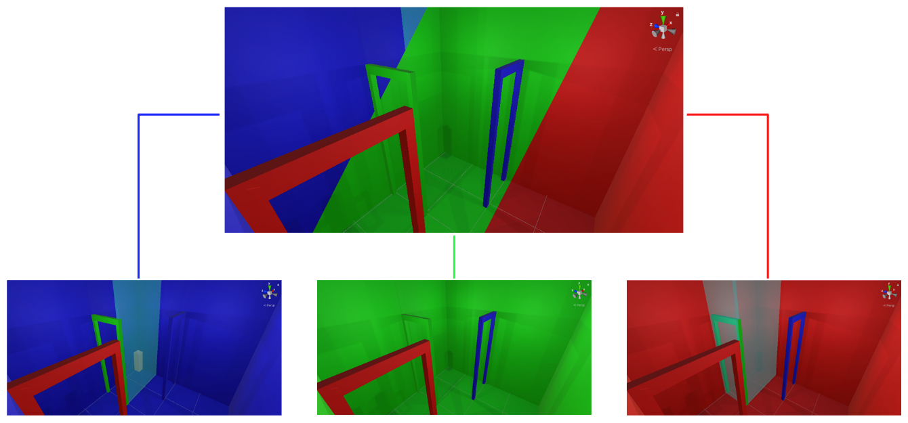

# Euclidean't

 
Team 6 
Aran, Gijs, Inger 
2020-10-16 

---

## Links
- [Project source](https://github.com/Euclidean-t/Euclidea-N-T)
- [Gameplay video](./Videos/Gameplay.mp4)

## Goal of the project
### Problem
If you want to explore an environment in virtual reality that is bigger than your physical play area, you need a way to move your character through the virtual space. The conventional way of doing this is by moving you virtual character without physically moving. Without training this will most likely induce dizziness or motion sickness.

### Solution
One way to solve this issue is by confining the virtual space within the physical space using non-euclidean geometry. This way the player does not have to move their virtual character seperately, and can seamlessly move through the virtual space using only physical movement.

## Technologies
### Virtual reality
Virtual reality is a way to immerse yourself within a virtual environment with near limitless potential. It still has some issues, but we want to try and solve one of the issues as described in the goal of the project. 

### Hand tracking
An additional feature now almost always included with virtual reality is hand tracking. When we came up with the idea to use non-euclidean space it seemed interesting to use hand tracking in a way that would desync your hand from the physical space and navigate it separately through the virtual space.

## Design
### Inspiration
The initial idea to use non-euclidean space to navigate a bigger virtual space within your physical play area sparked from Code Parade's ["Non-Euclidean Worlds Engine"](https://youtu.be/kEB11PQ9Eo8?t=245) video on YouTube. We all saw the value in the solution he proposed and it seemed like it had great potential for a VR game.

### Background research
A [blog](https://blog.wetzold.com/) by Wetzold Sutdios was a great help when researching similar virtual reality or non-euclidean games for inspiration. These games include but are not limited to:
- [Tea for God](https://void-room.itch.io/tea-for-god)
- [Spellbound Spire](https://void-room.itch.io/tea-for-god)
- [Sömmad](https://store.steampowered.com/app/676470/Sommad/)
- [Antichamber](https://store.steampowered.com/app/219890/Antichamber/)
- [Shadow Point](https://www.oculus.com/experiences/quest/2088119334554800/?locale=en_US)

### Design process
The concept of our game was quickly found and agreed upon. With the many interesting directions our initial design could take we quickly found a challenge in containg the scope of our project to something that could feasibly be finished within three weeks. 

The creation of puzzles in non-euclidean space also brought its own challenges. A life lived in a world ruled strictly by euclidean physics simply does not train the way of thinking necessary for such a task. The second puzzle, the maze, was especially challenging. In the final product we had to dial back the scope of this stage. This was partly due to hardware constraints and partly due to a sudden spike in complexity that was not appropiate for a second stage. 

## Created game
//TODO: Write about the gameplay and provide screenshots 

## Difficulties
### Design
//TODO: Write about difficulties creating puzzles in non-euclidean space

### Technology
#### Portals
Creating portals in games is not really that diffucult, it's just a camera projection on a plane. However, it gets quite difficult to do in VR as it requires 2 projections to the same plane in 1 render cycle (1 for each eye). Luckily we found [PocketPortalVR](https://assetstore.unity.com/packages/tools/particles-effects/pocket-portal-vr-85657), a portal solution for VR that uses dimensions relative to the other dimensions, exactly something we could use for our design. It did not work straight out of the box as Valve updated their OpenVR and SteamVR libraries to the Unity OpenXR package, after some work this was resolved. Though to render the portal on both eyes we had to enable multipass rendering which introduced an error on each render cycle, but did not jeopardice the performance as far as we could see.

As we wanted to track the hands in a way that would separate them from the player when entered another dimension we needed to track if the hand has gone through the portal. This introduced a load of problems as the portal did not use oblique rendering it projected the hand through the portal when it was in front of you, in the other dimension but not on the other side of the portal. We created a way to use oblique rendering when the player was at a distance from the portal, because if we enabled it at all times it would create other problems when morphing the portal plane for player and object transitions.

Later on in the development process we found that there was a bug when placing multiple portals in the same dimensions, somehow this introduced recursive rendering when that was not a possibility. We minimalized most of this issue by disabling levels on completion, though this does not remove all the lag. This original goal or reducing motion sickness is not helped by this issue, as the lag is motion sickness inducing.

## PMI
### Plus
- It is quite fun to walk around in such a huge space when confined to your small physical space.
- The result of seamlessly transfering to and from dimensions is satisfying.
- Portals are really fun to work with.
- It is a project that can be worked upon in the future with huge potential.

### Min
- Due to pressure from other courses and the limited development time of 3 weeks it felt a bit like we had to quit in the middle of development.
- Due to corona the testing process was jeopardized as we could not physically test it with others and we had limited access to VR headsets when we were not at home.
- The lag that was introduced with the bug in the portal software was quite frustrating.
- A lot of the work that had to be done was programming work. After the first week we had most of the design finished.

### Interesting
- Designing levels for non-euclidean space is quite hard, because it requires to keep track of the movement of the player that is not natural to us.
//TODO: These 2 below could be expanded upon
- The goal of reducing motion sickness.
- We had to change our way of thinking.

